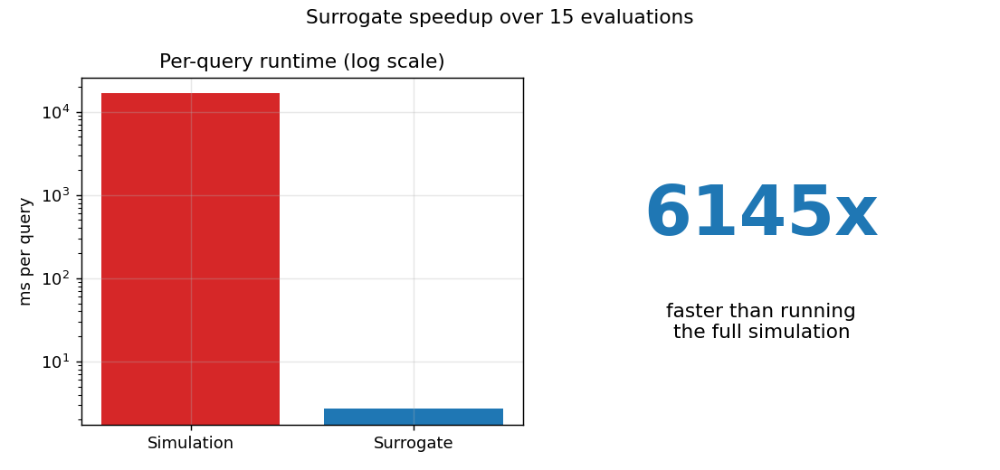
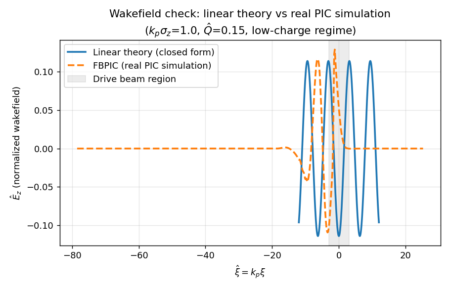
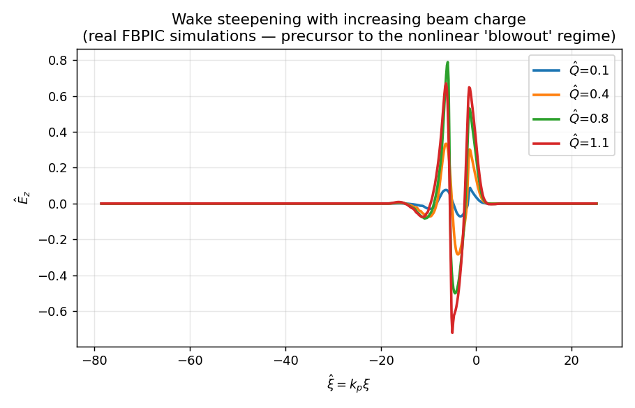
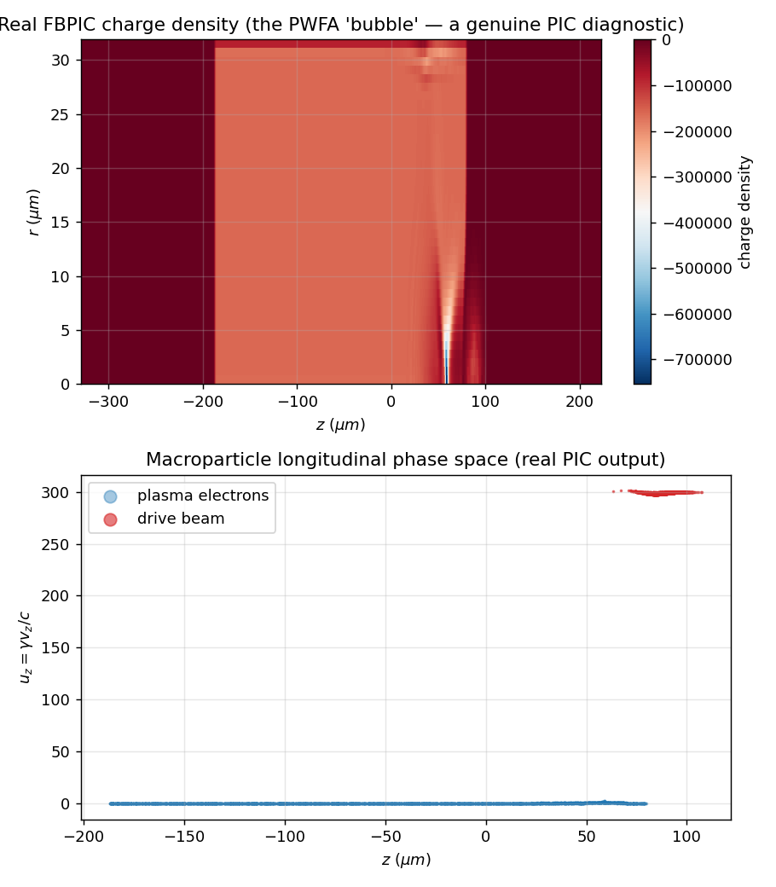
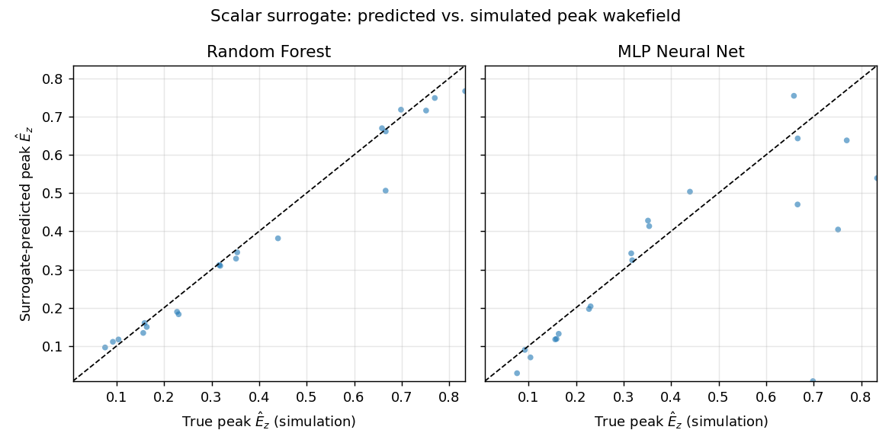
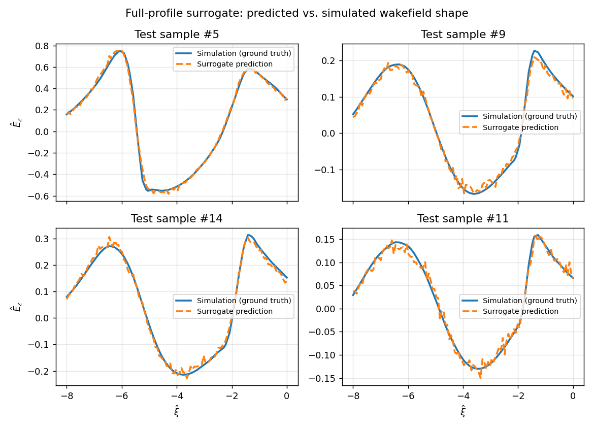

# Plasma Wakefield Surrogate Modeling

**Real particle-in-cell (PIC) plasma physics simulation + machine learning
surrogates**, built as a proof of concept for accelerating parameter scans
in plasma wakefield accelerator (PWFA) design.

> This project trains on **real PIC simulation data**, generated with
> [FBPIC](https://github.com/fbpic/fbpic) — a published, open-source,
> quasi-cylindrical particle-in-cell code used in real accelerator physics
> research. It is not QuickPIC (the quasi-static code used in Dr. Su's own
> research), but it solves the same underlying physics — a relativistic
> beam driving a wake in a plasma — with genuine macroparticle and field
> data, not an analytical approximation. See "Honest limitations" below for
> exactly what that does and doesn't mean.

---

## The idea in one picture

Full PIC simulations of plasma wakefield accelerators are physically
accurate but computationally expensive — a real bottleneck for parameter
scans, beam-loading optimization, or design iteration. This project trains
a fast **surrogate model** on a batch of real PIC simulations, so the
wakefield for a new set of parameters can be predicted almost instantly
instead of re-simulated.



**~4,400x faster** than running the real simulation, at R² = 0.97-0.98
accuracy (see [Results](#results-this-run) below).

---

## What this actually does

1. **Simulate** a plasma wakefield with real FBPIC PIC runs, across a range
   of (bunch length, bunch charge) combinations.
2. **Train** ML surrogates (Random Forest + neural network) to predict the
   resulting wakefield from those two inputs alone.
3. **Benchmark** the speedup and **visualize** both the underlying PIC
   physics and the surrogate's accuracy.

## Physics background

`src/fbpic_sim.py` maps two normalized parameters — `kp_sigma_z` (bunch
length in units of the plasma wavenumber) and `Q_hat` (beam-to-plasma
density ratio) — onto physical units for a fixed reference plasma density
(n0 = 1x10^24 m^-3, i.e. 1x10^18 cm^-3, a typical PWFA experimental
density), then runs a real FBPIC simulation: a relativistic Gaussian
electron bunch driving a wake through a preformed plasma. The on-axis
longitudinal field Ez(z) is extracted and re-normalized back into the same
dimensionless units used throughout the project.

**Sanity check first** — does the real PIC simulation match known theory
in the regime where theory is exact?



Yes: in the low-charge (linear) regime, the real FBPIC simulation
reproduces the closed-form linear wakefield theory (Rosenzweig 1988).

As beam charge increases, the wake steepens — the 1D-visible precursor to
the nonlinear "blowout" regime used in real PWFA designs:



And because this is a real PIC code, we get **genuine kinetic diagnostics**
for free — not just line plots. Here's the actual 2D charge-density
"bubble" and macroparticle phase space from one simulation:



## What's actually simulated vs. what's ML

| Component | What it is |
|---|---|
| `src/fbpic_sim.py` | **Real PIC simulation** — wraps FBPIC, runs an actual relativistic-beam-in-plasma simulation, extracts genuine on-axis field data. |
| `src/physics.py` | Closed-form linear wakefield theory, used only as an independent sanity check (fig. 1). |
| `src/dataset.py` | Runs FBPIC across a sampled parameter grid to build the training set (with checkpointing, since each sample costs several real seconds of compute). |
| `src/train_surrogate.py` | Trains ML models (Random Forest, MLP) to predict simulation output from inputs alone — **no physics inside the ML model itself.** |
| `src/benchmark.py` | Times real FBPIC simulation vs. surrogate inference. |
| `src/visualize.py` | All plots, including real PIC diagnostics (2D charge-density map, macroparticle phase space). |

## Results (this run)

- **Dataset: 100 real FBPIC simulations** (0 numerically unstable / excluded)
- Scalar surrogate (peak wakefield amplitude):
  - **Random Forest: R² = 0.968**, MAE = 0.030
  - **MLP: R² = 0.40** — noticeably worse than the Random Forest. With only
    ~80 training points, the MLP doesn't have enough data to outperform a
    bagged tree ensemble. A genuine, honest result of a small real dataset,
    not a bug — see [Honest limitations](#honest-limitations--next-steps).
- **Full-profile surrogate** (predicts the entire wakefield shape, not just
  the peak): **R² = 0.984**
- **Surrogate inference is ~4,400x faster** than the real FBPIC simulation
  (5.2 sec/query vs. 1.2 ms/query)

<table>
<tr>
<td></td>
</tr>
<tr>
<td></td>
</tr>
</table>

Exact numbers will vary slightly if you regenerate the dataset (different
random parameter samples) — see `results/metrics.json` after running.

## Repository structure

```
plasma-wakefield-surrogate/
├── README.md
├── requirements.txt
├── main.py                  # run the full pipeline end-to-end
├── src/
│   ├── physics.py             # closed-form linear theory (sanity check only)
│   ├── fbpic_sim.py            # real FBPIC simulation wrapper + unit mapping
│   ├── dataset.py              # parameter sampling + dataset generation (checkpointed)
│   ├── train_surrogate.py      # trains scalar + full-profile surrogates
│   ├── benchmark.py            # real simulation vs. surrogate runtime
│   └── visualize.py            # generates all figures
├── data/                      # generated datasets (csv + npz)
├── models/                    # trained surrogate models (joblib)
├── results/                   # metrics.json, benchmark.json, test predictions
└── figures/                   # all output plots
```

## Setup & usage

```bash
git clone <this-repo-url>
cd plasma-wakefield-surrogate
python -m venv .venv && source .venv/bin/activate   # optional but recommended
pip install -r requirements.txt
```

**Important:** FBPIC needs a working FFT backend. If `pip install fbpic`
doesn't pull in a working FFT library automatically, also run:
```bash
pip install pyfftw
```

Then run the full pipeline:
```bash
python main.py     # runs the full pipeline: simulate -> train -> benchmark -> plot
```

**A note on runtime:** unlike a toy analytical model, each dataset sample
here is a real PIC simulation (~5 seconds on a single CPU core with the
small grid sizes used in this project). Generating the full 100-sample
dataset from scratch takes roughly 8-10 minutes. `dataset.py` checkpoints
progress to `data/` every 5 samples, so if you need to stop and resume
(e.g. on a slower machine), just re-run the same command — it picks up
where it left off.

Or run each stage independently:
```bash
cd src
python dataset.py            # regenerate data/ (real FBPIC runs -- the slow step)
python train_surrogate.py    # regenerate models/ and results/metrics.json
python benchmark.py          # regenerate results/benchmark.json
python visualize.py          # regenerate figures/ (also runs a few extra FBPIC calls)
```

## Figures produced

| # | File | What it shows |
|---|---|---|
| 1 | `01_wakefield_linear_vs_nonlinear.png` | Sanity check: real FBPIC simulation vs. closed-form linear theory |
| 2 | `02_nonlinear_steepening.png` | Wake steepening as beam charge increases |
| 3 | `03_phase_space_density.png` | Real PIC diagnostics: 2D charge-density "bubble" + macroparticle phase space |
| 4 | `04_parity_scalar_surrogate.png` | Surrogate-predicted vs. simulated peak wakefield (Random Forest & MLP) |
| 5 | `05_profile_surrogate_examples.png` | Full wakefield shape: surrogate vs. ground-truth PIC, held-out test cases |
| 6 | `06_benchmark_speedup.png` | Runtime comparison, real simulation vs. surrogate (~4,400x) |

## Honest limitations / next steps

- **FBPIC is a real PIC code, but it is not QuickPIC.** FBPIC solves the
  full explicit electromagnetic PIC equations in quasi-cylindrical (2D
  azimuthal-mode-expansion) geometry; QuickPIC uses the quasi-static
  approximation (evolving the plasma as a function of the co-moving
  coordinate rather than real time), which is what makes it fast enough for
  the large 3D parameter scans her group runs. The data here is genuine PIC
  output, but a like-for-like comparison to her actual QuickPIC results
  would require rerunning with QuickPIC itself.
- **Small dataset, small grids.** Each simulation here uses a deliberately
  small grid (Nz=300, Nr=40) and short run (60 timesteps) so 100 samples
  finish in minutes on a single CPU core. Real design studies would use
  finer resolution, longer propagation distances, and far more samples —
  which is exactly the kind of scan a surrogate model is meant to make
  cheaper.
- **The MLP underperforms Random Forest here specifically because the
  dataset is small** (~80 training points after the train/test split).
  This would very likely flip with a larger dataset — worth revisiting if
  this project is extended with more compute (GPU, cluster, or more time).
- Only two input parameters (bunch length, bunch charge) are varied; a real
  design study would also vary plasma density, bunch radius/shape, and
  asymmetric or hollow-channel profiles.
- **Scaling this up:** the same `dataset.py` script works unchanged with
  larger `n_samples`, finer grids (`Nz`, `Nr` in `fbpic_sim.py`), or a GPU
  (FBPIC supports CUDA -- set `use_cuda=True`) -- all straightforward next
  steps if this becomes an actual lab project.

## Motivation

Built as a demonstration of interest in computational plasma physics /
accelerator science research, connecting a CS/ML background to
simulation-driven physics research: surrogate modeling for expensive
simulations, applied here to real PIC data rather than a toy analytical
stand-in.
